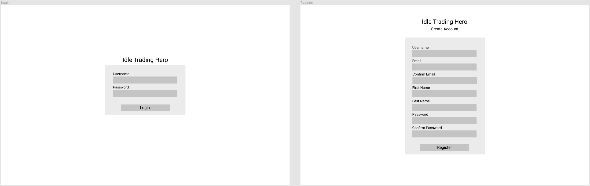
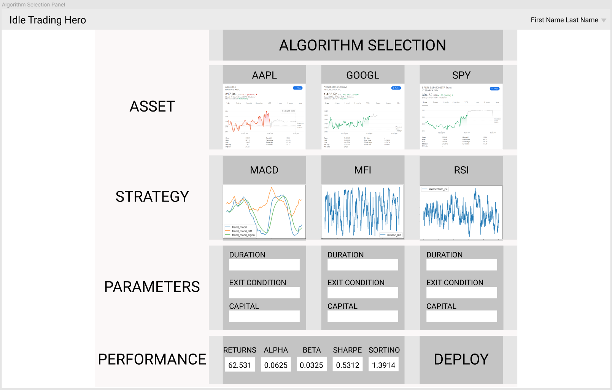

# Idle Trading Hero

An Artemis-level project for Orbital, CP2106: Independent Software Development Project at NUS School of Computing.

# Project Motivation

Algorithmic trading (or automated trading) uses trading algorithms to place trades, generating profits at a speed and frequency impossible for a human trader. Idle Trading Hero serves as a trading platform for traders to jumpstart deployment of automated trading strategies, coupled with an analytics dashboard for profit visualisation. We hope that through this project, we learn more about quantitative finance while gaining side income in the process.

# Core Features

## 1. User Login System

Traders can register and login to manage personal accounts and trading strategies.

## 2. Algorithm Selection Panel

The panel allows traders to select: 1. Assets, 2. Strategies, 3. Parameters, along with backtesting performance indications so that traders can make the optimal automated trading decisions.

| Available Assets                         | Available Strategies                        | Available Parameters |
|------------------------------------------|---------------------------------------------|----------------------|
| AAPL: Apple Inc.                         | MACD: Moving Average Convergence/Divergence | Duration             |
| GOOGL: Alphabet Inc Class A              | MFI: Money Flow Index                       | Exit Condition       |
| SPY: SPDR S&P 500 ETF Trust              | RSI: Relative Strength Index                | Capital              |
| VOO: VANGUARD IX FUN/S&P 500 ETF SHS NEW |                                             | Algorithm Parameters |
| To be added                              | To be added                                 | To be added          |

## 3. Analytics Visualisation Dashboard

The dashboard allows traders to visualise real-time performance analytics, ranging from total returns to Sharpe and Sortino ratios to gain insights about the automated trading algorithm.

## 4. Live Deployment

Live deployment is coupled with live notifications whenever the algorithm performs a buy/sell action or exit trigger, to the comfort of the trader's Telegram or email.
